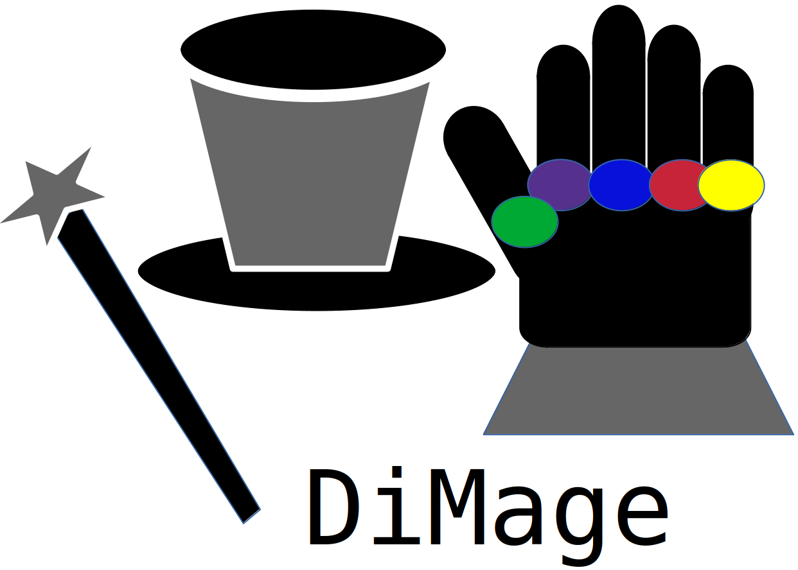

## DiMage: The DIstributed Mapping GEnerator.


**Official Artifact of the SC'23 paper: "Automatic Generation of Distributed-Memory Mappings for Tensor Computations".**
**Authors: Martin Kong, Raneem Abu Yosef, Atanas Rountev and P. Sadayappan.**
**DOI: https://dl.acm.org/doi/10.1145/3581784.3607096**

### What is DiMage?



DiMage is a distributed-memory mapping generator for Directed Acyclic Graphs (DAGs) of tensor computations. Given the compact description of an input DAG, DiMage will find a communication efficient mapping that partitions both the data and computation of the DAG over a grid of processing elements (PEs) of a fixed dimensionality and size. DiMage will produce a non-linear formulation that is solved, in an iterative manner, using the Z3 SMT solver. After a solution is found, DiMage will proceed to generate MPI code matching the mapping definition. 

Please refer to the [DiMage SC'23 paper](https://dl.acm.org/doi/10.1145/3581784.3607096) for more details of the formulation.

DiMage is still a research prototype in active development. Please report any issues found.


### Installation

Follow the following steps to create a Conda environment with Z3:

```
export DIMAGE_CONDA_ENV=dimage-conda
export DIMAGE_CONDA_CONFIG_FILE=z3-env-config.txt

target="Anaconda3-2023.03-1-Linux-x86_64.sh"
wget https://repo.anaconda.com/archive/$target
bash $target

conda create --name ${DIMAGE_CONDA_ENV} --file ${DIMAGE_CONDA_CONFIG_FILE}

conda init bash

conda activate ${DIMAGE_CONDA_ENV}

pip install z3-solver

```


### Using DiMage

To use DiMage, activate first the Conda environment. Then, invoke DiMage:

```
python dimage.py <input.rels> -procs=<G,P>
```

where G must be one of '1D', '2D' or '3D', and P is the exact number of processes to be used followed by 'p'. Valid examples for the '-procs' flag are "-procs=1D,4p" and "-procs=2D,8p".

Use the '-help' option to see the full set of flags:

python dimage.py -help

DiMage will generate a standalone MPI source code and a Makefile. For local computations, the current version can use an auto-generated code or Intel MKL. These can be built with:

```
make dist
```

and

```
make mkl
```


### Citation

To cite DiMage's SC'23 paper, please use the following bibtex:

```
@inproceedings{10.1145/3581784.3607096,
author = {Kong, Martin and Abu Yosef, Raneem and Rountev, Atanas and Sadayappan, P.},
title = {Automatic Generation of Distributed-Memory Mappings for Tensor Computations},
year = {2023},
isbn = {9798400701092},
publisher = {Association for Computing Machinery},
address = {New York, NY, USA},
url = {https://doi.org/10.1145/3581784.3607096},
doi = {10.1145/3581784.3607096},
booktitle = {Proceedings of the International Conference for High Performance Computing, Networking, Storage and Analysis},
articleno = {64},
numpages = {13},
location = {Denver, CO, USA},
series = {SC '23}
}
```

